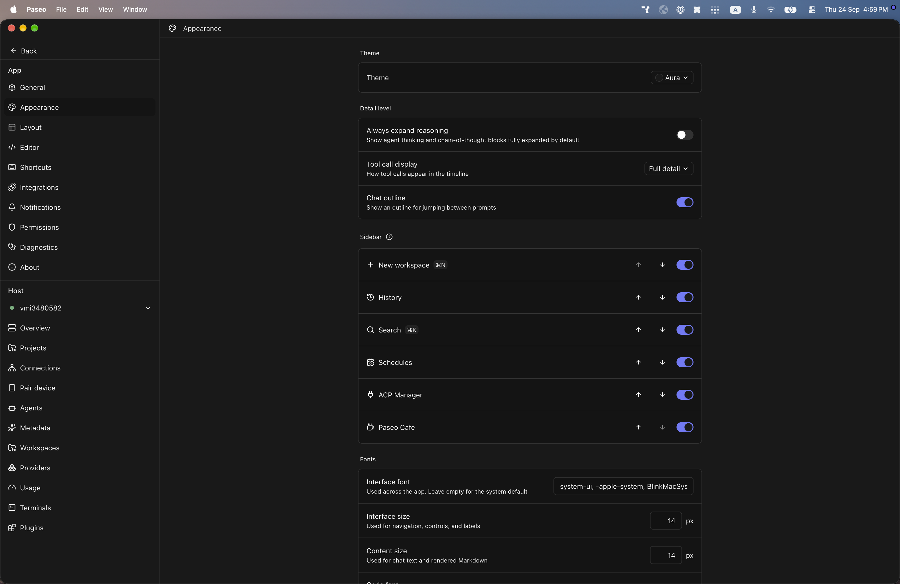
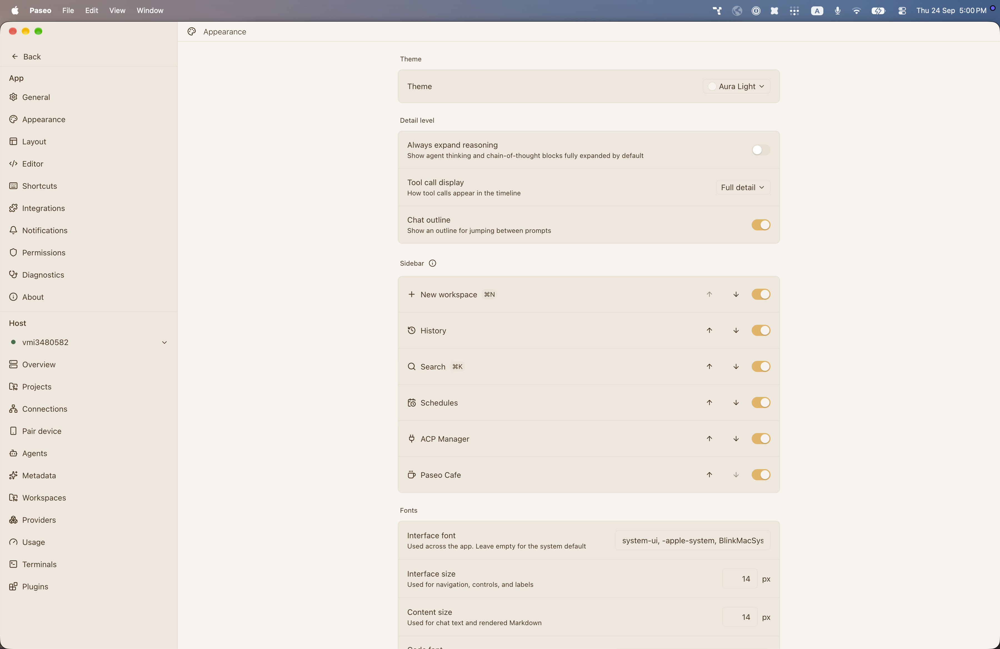

# paseo-aura-theme

Aura for [Paseo](https://paseo.sh), ported from the Obsidian theme [`shadowash8/obsidian-aura`](https://github.com/shadowash8/obsidian-aura) by shadowash8.

## Install

```bash
paseo plugin install npm:@alhassanaraouf/paseo-aura-theme
```

## Activate

1. Open **Settings \u2192 Appearance**.
2. Set **Theme** to **Aura** for the dark variant or **Aura Light** for the light variant.

## Themes

This plugin contributes two `addTheme` variants derived from the upstream Obsidian palette.

## Preview




## License

[MIT License](./LICENSE). Palette values come from the upstream Obsidian theme (see link above).
