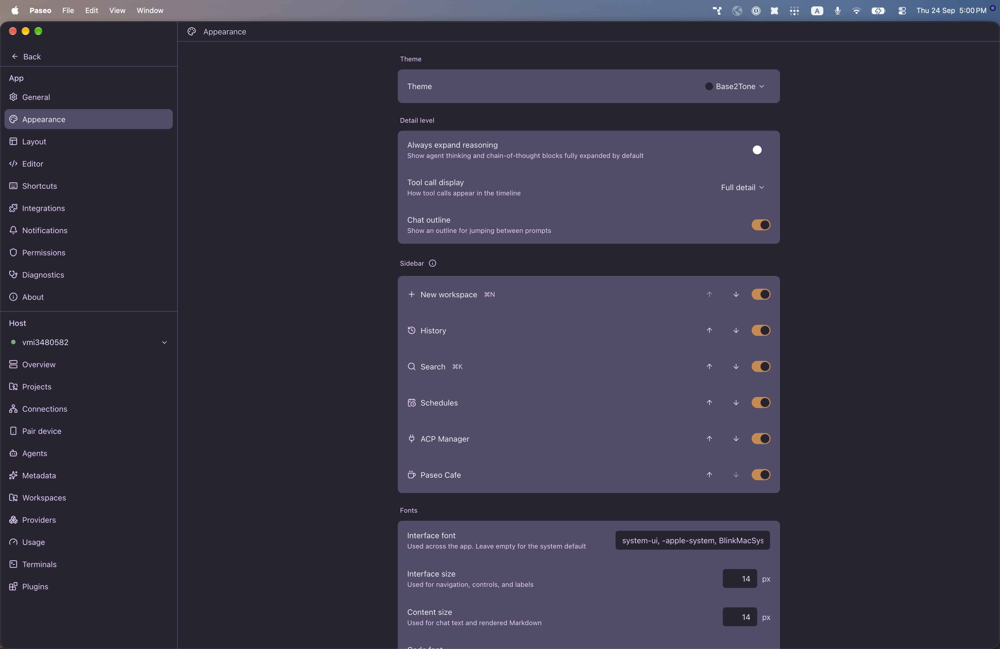

# paseo-base2tone-theme

Base2Tone for [Paseo](https://paseo.sh), ported from the Obsidian theme [`deathau/Base2Tone-For-Obsidian.md`](https://github.com/deathau/Base2Tone-For-Obsidian.md) by deathau.

## Install

```bash
paseo plugin install npm:@alhassanaraouf/paseo-base2tone-theme
```

## Activate

1. Open **Settings \u2192 Appearance**.
2. Set **Theme** to **Base2Tone**.

## Themes

This plugin contributes one `dark`-mode `addTheme` variant derived from the upstream Obsidian palette.

## Preview



## License

[MIT License](./LICENSE). Palette values come from the upstream Obsidian theme (see link above).
