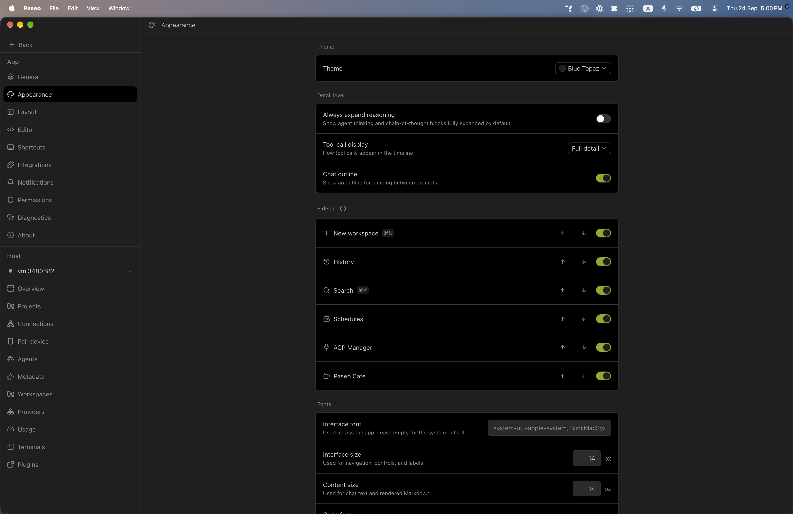
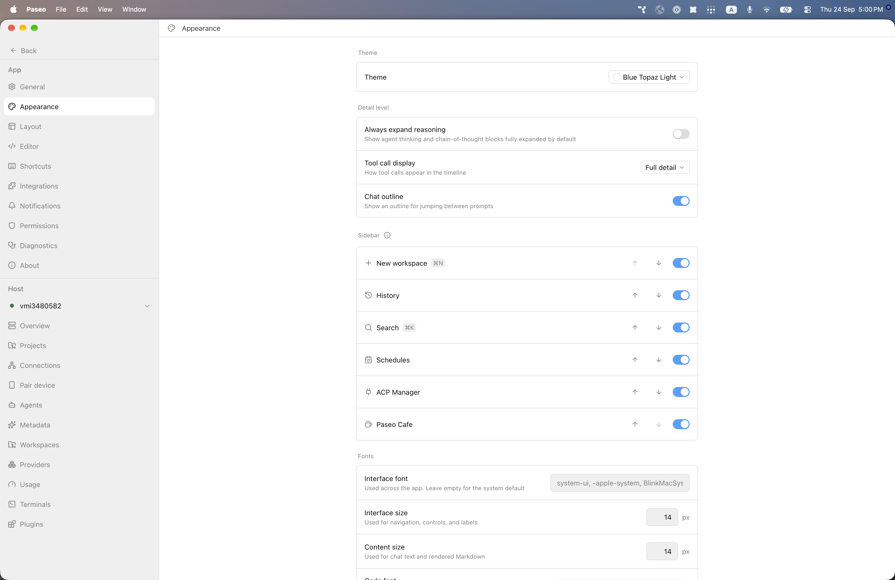

# paseo-blue-topaz-theme

Blue Topaz for [Paseo](https://paseo.sh), ported from the Obsidian theme [`pkm-er/Blue-Topaz_Obsidian-css`](https://github.com/pkm-er/Blue-Topaz_Obsidian-css) by pkm-er.

## Install

```bash
paseo plugin install npm:@alhassanaraouf/paseo-blue-topaz-theme
```

## Activate

1. Open **Settings \u2192 Appearance**.
2. Set **Theme** to **Blue Topaz** for the dark variant or **Blue Topaz Light** for the light variant.

## Themes

This plugin contributes two `addTheme` variants derived from the upstream Obsidian palette.

## Preview




## License

[MIT License](./LICENSE). Palette values come from the upstream Obsidian theme (see link above).
