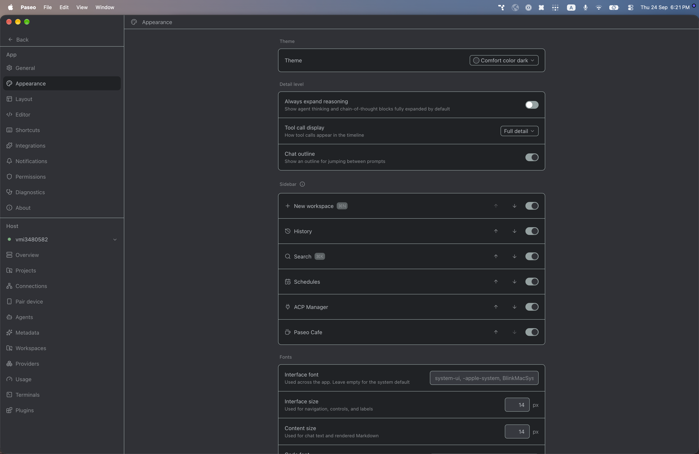

# paseo-comfort-color-dark-theme

Comfort color dark for [Paseo](https://paseo.sh), ported from the Obsidian theme [`obsidian-ezs/obsidian-comfort-color-dark`](https://github.com/obsidian-ezs/obsidian-comfort-color-dark) by obsidian-ezs.

## Install

```bash
paseo plugin install npm:@alhassanaraouf/paseo-comfort-color-dark-theme
```

## Activate

1. Open **Settings \u2192 Appearance**.
2. Set **Theme** to **Comfort color dark**.

## Themes

This plugin contributes one `dark`-mode `addTheme` variant derived from the upstream Obsidian palette.

## Preview



## License

[MIT License](./LICENSE). Palette values come from the upstream Obsidian theme (see link above).
