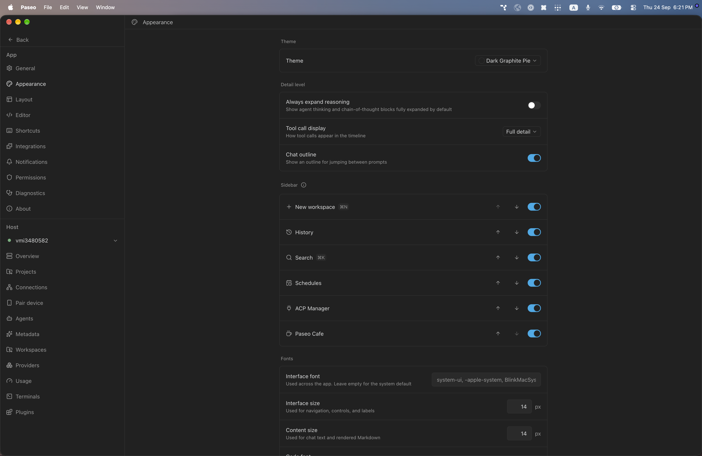
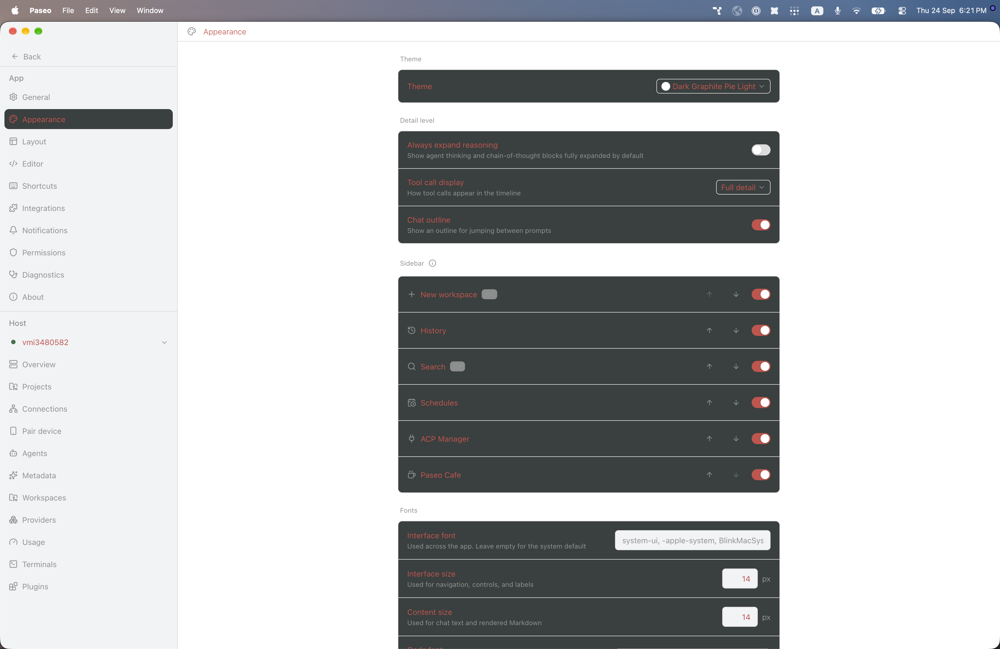

# paseo-dark-graphite-pie-theme

Dark Graphite Pie for [Paseo](https://paseo.sh), ported from the Obsidian theme [`ryjjin/Obsidian-Dark-Graphite-Pie-theme`](https://github.com/ryjjin/Obsidian-Dark-Graphite-Pie-theme) by ryjjin.

## Install

```bash
paseo plugin install npm:@alhassanaraouf/paseo-dark-graphite-pie-theme
```

## Activate

1. Open **Settings \u2192 Appearance**.
2. Set **Theme** to **Dark Graphite Pie** for the dark variant or **Dark Graphite Pie Light** for the light variant.

## Themes

This plugin contributes two `addTheme` variants derived from the upstream Obsidian palette.

## Preview





## License

[MIT License](./LICENSE). Palette values come from the upstream Obsidian theme (see link above).
