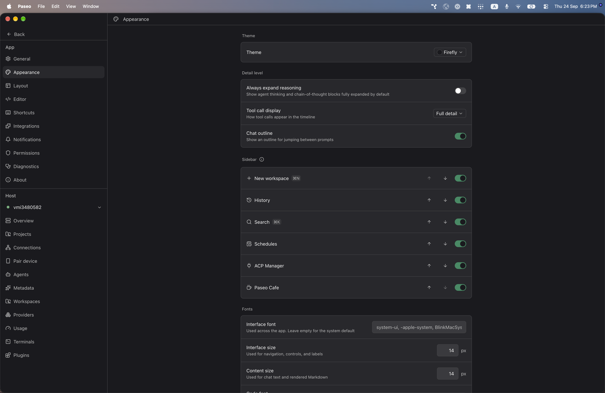

# paseo-firefly-theme

Firefly for [Paseo](https://paseo.sh), ported from the Obsidian theme [`lazercaveman/obsidian-firefly-theme`](https://github.com/lazercaveman/obsidian-firefly-theme) by lazercaveman.

## Install

```bash
paseo plugin install npm:@alhassanaraouf/paseo-firefly-theme
```

## Activate

1. Open **Settings \u2192 Appearance**.
2. Set **Theme** to **Firefly**.

## Themes

This plugin contributes one `dark`-mode `addTheme` variant derived from the upstream Obsidian palette.

## Preview



## License

[MIT License](./LICENSE). Palette values come from the upstream Obsidian theme (see link above).
