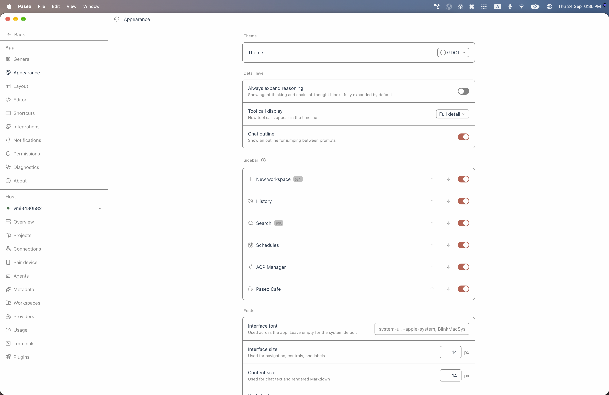

# paseo-gdct-theme

GDCT for [Paseo](https://paseo.sh), ported from the Obsidian theme [`bcdavasconcelos/Obsidian-GDCT`](https://github.com/bcdavasconcelos/Obsidian-GDCT) by bcdavasconcelos.

## Install

```bash
paseo plugin install npm:@alhassanaraouf/paseo-gdct-theme
```

## Activate

1. Open **Settings \u2192 Appearance**.
2. Set **Theme** to **GDCT**.

## Themes

This plugin contributes one `light`-mode `addTheme` variant derived from the upstream Obsidian palette.

## Preview



## License

[MIT License](./LICENSE). Palette values come from the upstream Obsidian theme (see link above).
