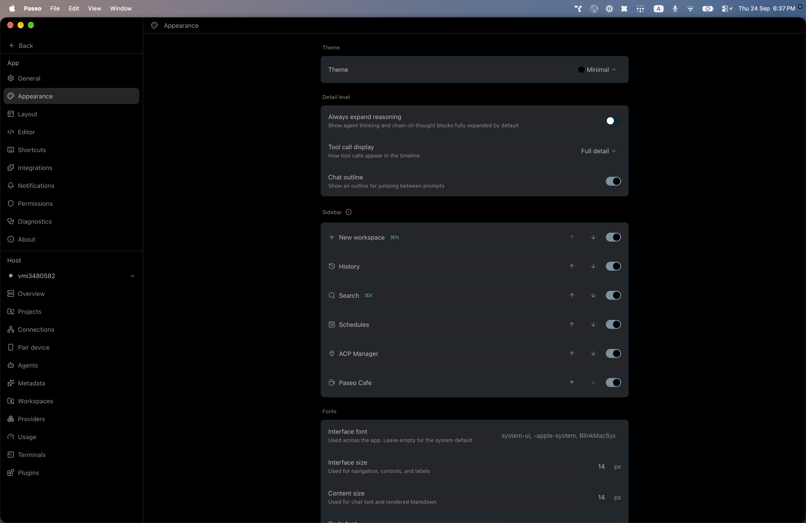
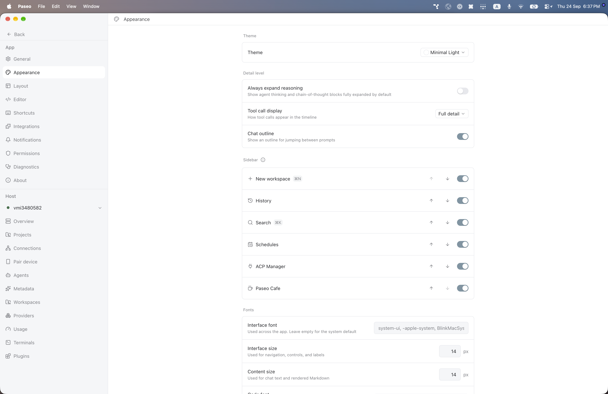

# paseo-minimal-theme

Minimal for [Paseo](https://paseo.sh), ported from the Obsidian theme [`kepano/obsidian-minimal`](https://github.com/kepano/obsidian-minimal) by kepano.

## Install

```bash
paseo plugin install npm:@alhassanaraouf/paseo-minimal-theme
```

## Activate

1. Open **Settings \u2192 Appearance**.
2. Set **Theme** to **Minimal** for the dark variant or **Minimal Light** for the light variant.

## Themes

This plugin contributes two `addTheme` variants derived from the upstream Obsidian palette.

## Preview





## License

[MIT License](./LICENSE). Palette values come from the upstream Obsidian theme (see link above).
