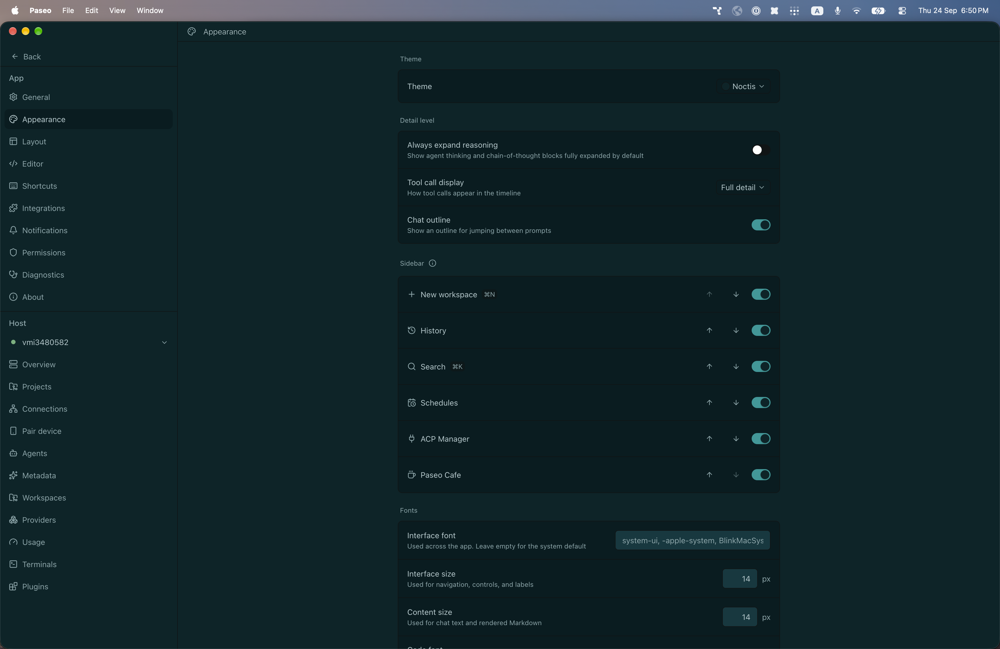

# paseo-noctis-theme

Noctis for [Paseo](https://paseo.sh), ported from the Obsidian theme [`konnta0/obsidian-noctis-theme`](https://github.com/konnta0/obsidian-noctis-theme) by konnta0.

## Install

```bash
paseo plugin install npm:@alhassanaraouf/paseo-noctis-theme
```

## Activate

1. Open **Settings \u2192 Appearance**.
2. Set **Theme** to **Noctis**.

## Themes

This plugin contributes one `dark`-mode `addTheme` variant derived from the upstream Obsidian palette.

## Preview



## License

[MIT License](./LICENSE). Palette values come from the upstream Obsidian theme (see link above).
