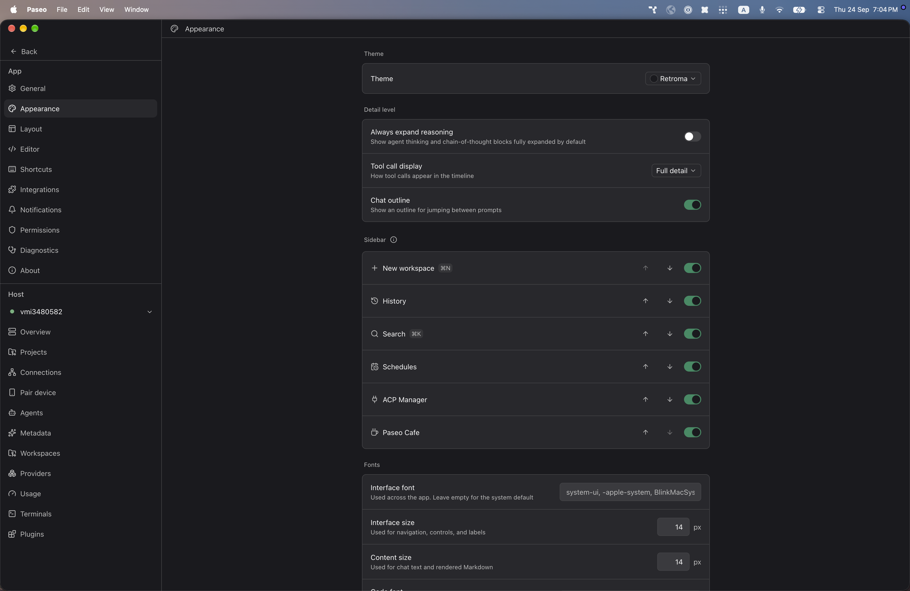
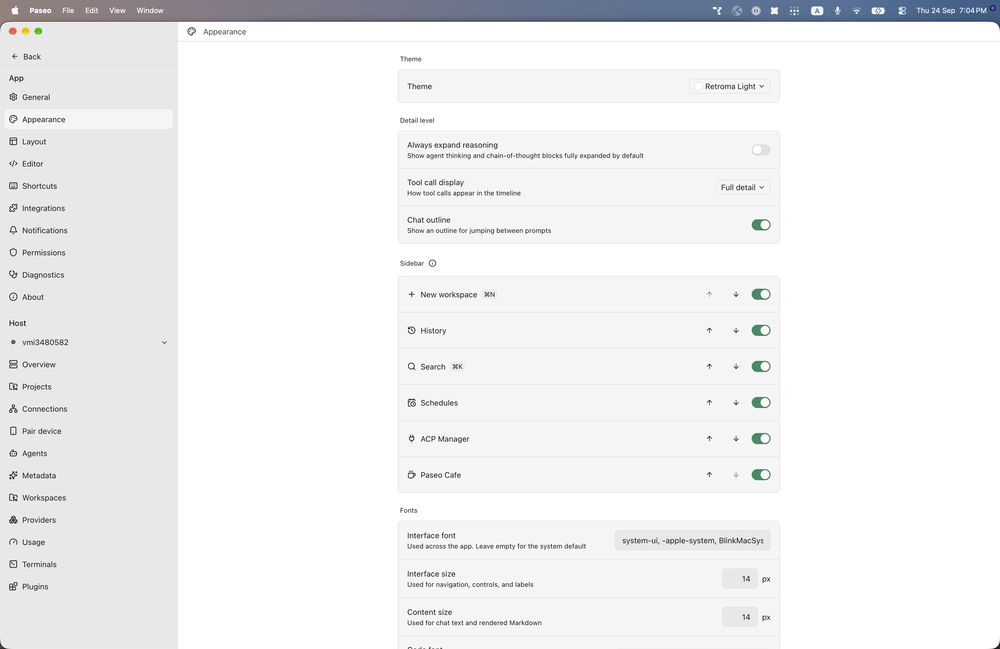

# paseo-retroma-theme

Retroma for [Paseo](https://paseo.sh), ported from the Obsidian theme [`emarpiee/Retroma`](https://github.com/emarpiee/Retroma) by emarpiee.

## Install

```bash
paseo plugin install npm:@alhassanaraouf/paseo-retroma-theme
```

## Activate

1. Open **Settings \u2192 Appearance**.
2. Set **Theme** to **Retroma** for the dark variant or **Retroma Light** for the light variant.

## Themes

This plugin contributes two `addTheme` variants derived from the upstream Obsidian palette.

## Preview





## License

[MIT License](./LICENSE). Palette values come from the upstream Obsidian theme (see link above).
