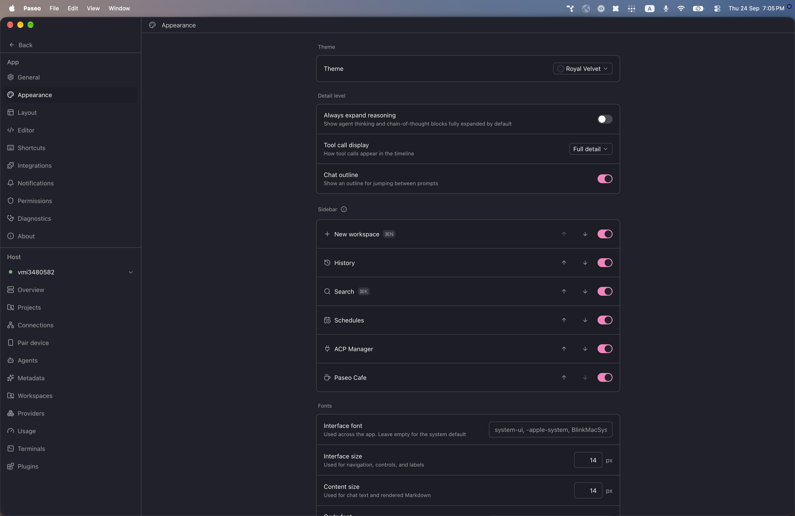
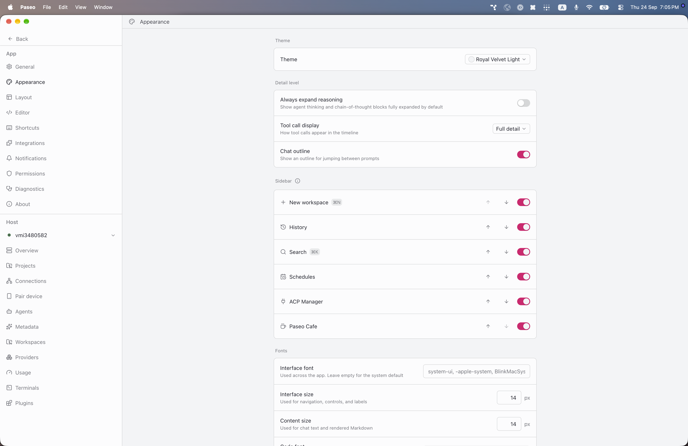

# paseo-royal-velvet-theme

Royal Velvet for [Paseo](https://paseo.sh), ported from the Obsidian theme [`caro401/royal-velvet`](https://github.com/caro401/royal-velvet) by caro401.

## Install

```bash
paseo plugin install npm:@alhassanaraouf/paseo-royal-velvet-theme
```

## Activate

1. Open **Settings \u2192 Appearance**.
2. Set **Theme** to **Royal Velvet** for the dark variant or **Royal Velvet Light** for the light variant.

## Themes

This plugin contributes two `addTheme` variants derived from the upstream Obsidian palette.

## Preview





## License

[MIT License](./LICENSE). Palette values come from the upstream Obsidian theme (see link above).
