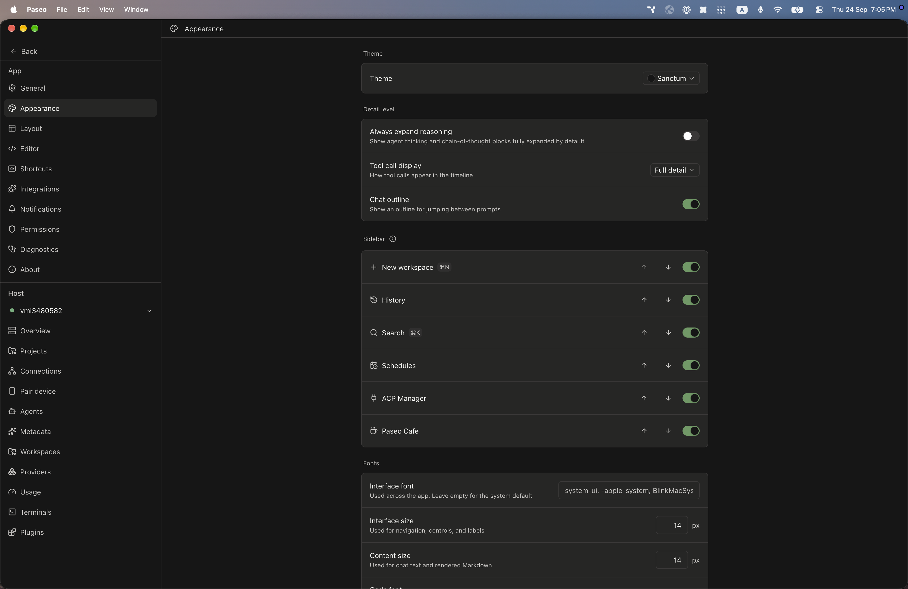
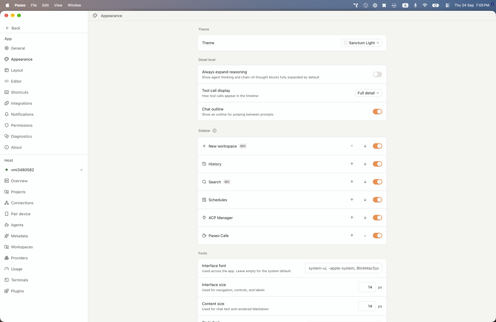

# paseo-sanctum-theme

Sanctum for [Paseo](https://paseo.sh), ported from the Obsidian theme [`jdanielmourao/obsidian-sanctum`](https://github.com/jdanielmourao/obsidian-sanctum) by jdanielmourao.

## Install

```bash
paseo plugin install npm:@alhassanaraouf/paseo-sanctum-theme
```

## Activate

1. Open **Settings \u2192 Appearance**.
2. Set **Theme** to **Sanctum** for the dark variant or **Sanctum Light** for the light variant.

## Themes

This plugin contributes two `addTheme` variants derived from the upstream Obsidian palette.

## Preview





## License

[MIT License](./LICENSE). Palette values come from the upstream Obsidian theme (see link above).
